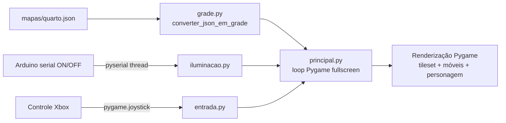

# Maptale

Jogo top-down em pixel art para Raspberry Pi. O cenário é um mapa local
fixido em JSON ([`schema/mapa.schema.json`](schema/mapa.schema.json)),
renderizado em Pygame em tela cheia.

1. **Jogo do Raspberry Pi (Python + Pygame)** —
   [`raspberry_game/`](raspberry_game/): carrega `mapas/quarto.json`,
   converte em grade de tiles e roda o personagem no quarto + banheiro.
2. **Arduino** (fora deste repositório): envia `ON`/`OFF` via serial para
   controlar a iluminação da cena.

## Fluxo de dados

## Onde começar

- Jogo/Raspberry Pi: veja [`raspberry_game/README.md`](raspberry_game/README.md).
- Contrato do mapa: veja [`schema/mapa.schema.json`](schema/mapa.schema.json).

## Assets

Os tiles e móveis são gerados por
`raspberry_game/assets/gerador_tiles.py` (Pillow). Rode o gerador antes
da primeira execução se os PNGs ainda não existirem.
