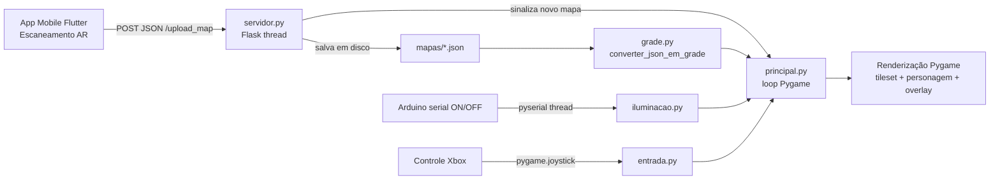

# Maptale

Sistema de 3 partes que se comunicam por um schema JSON compartilhado
([`schema/mapa.schema.json`](schema/mapa.schema.json)):

1. **App mobile (Flutter + AR)** - [`app_mobile/`](app_mobile/): escaneia um
   ambiente real (paredes, portas, janelas, objetos) usando detecção de
   plano e hit-test AR, gera o JSON do schema e envia via HTTP para o
   Raspberry Pi.
2. **Jogo do Raspberry Pi (Python + Pygame + Flask)** -
   [`raspberry_game/`](raspberry_game/): recebe o JSON, converte em uma
   grade de tiles e roda um jogo top-down pixel art onde o ambiente
   escaneado vira o cenário jogável.
3. **Arduino** (fora deste repositório): envia `ON`/`OFF` via serial para
   controlar a iluminação da cena.

## Fluxo de dados

## Onde começar

- App mobile: veja [`app_mobile/README.md`](app_mobile/README.md).
- Jogo/Raspberry Pi: veja [`raspberry_game/README.md`](raspberry_game/README.md).
- Contrato de dados: veja [`schema/mapa.schema.json`](schema/mapa.schema.json).

## Status / próximos passos

- Tileset e spritesheet ainda são placeholders (retângulos/formas
  coloridas); basta soltar os PNGs finais nas pastas indicadas em cada
  README.
- Sem autenticação no upload HTTP (assume rede local confiável).
- Sem renderização 3D de marcadores durante o escaneamento AR (feedback é
  textual: contador de pontos + última coordenada).
